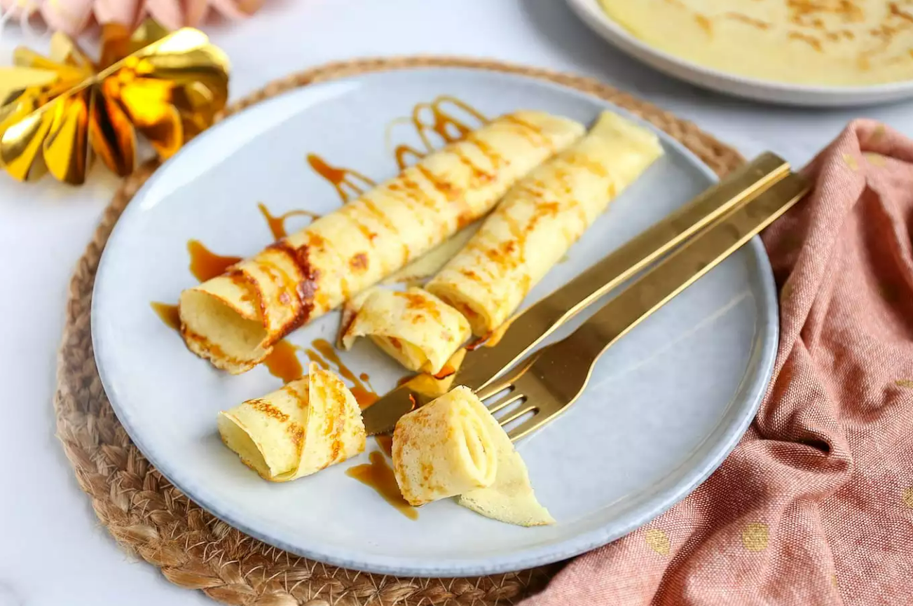

# Pannenkoeken recept

Zelf pannenkoeken maken is helemaal niet moeilijk, en je hebt geen pakje nodig.\
Met eieren, bloem, melk en zout is dit recept zo klaar.

- Bereidingstijd: 20 min
- Recept voor: 3 personen

## Benodigdheden
- 2 eieren
- 250 gr bloem
- 500 ml melk
- zout

### Lekkere extra's
- Kaas (en stroop)
- Ham en kaas
- Spek en kaas
- Stroop
- Chocoladepasta
- Jam
- (Poeder) Suiker en kaneel
- Plakjes banaan en chocoladepasta
- Gebakken appel en kaneel
- Aardbeien en ijs

#### Bereidingswijze
- Meng in een kom de eieren, de bloem, melk en een snufje zout. Als alle klontjes zijn verdwenen, kunnen de pannenkoeken gebakken worden.
- Verwarm een beetje boter of margarine in een pan. 
- Wacht even totdat de pan goed warm is, en verdeel dan met een soeplepel wat beslag in het midden van de pan. 
- Beweeg je pan een beetje heen en weer zodat het beslag over de hele pan verdeeld is. 
- Bak de pannenkoek ongeveer 2-3 minuten totdat de bovenkant droog is. 
- Draai de pannenkoek om en bak de pannenkoek nog ongeveer 1-2 minuten op de andere kant.
- Leg de pannenkoek op een bord en dek het bord af met een grote deksel. 
- Bak zo de rest van de pannenkoeken. 
- Vergeet niet om iedere keer een beetje extra boter of margarine in de pan te doen, voordat je een nieuwe pannenkoek bakt.

---

[Bron naar het recept voor meer informatie](https://www.lekkerensimpel.com/basisrecept-voor-pannenkoeken/)